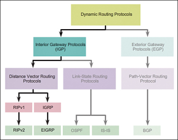

# Samenvatting Scaling Networks
## H1: LAN design

> Lezen in de cursus

## H2: Scaling VLANs: VTP, Extended VLANs and DTP

### VTP:

**Vlan trunking protocol** eliminates the need to configure a new VLAN on every switch.
VTP sores VLAN configuration in vlan.dat
VTP V1-2 only learns about normal range vlans (1-5000), V3 support extended VLANs
VTP advertisemenst only in domain (router or l3 switch define the boundary of each domain)

#### VTP modes:

- **Server**
    + Advertises the VTP domain VLAN information to other VTP-enabled switches in the same domain
    + Stores vlan.dat in NVRAM
    + CRUD on VLANs in domain
    + **Default mode**

- **Client**
    + No CRUD on VLANs
    + Stores vlan.dat in RAM
    + Must be confiured as VTP client

- **Transparant**
    + Does not participate in VTP expect forward VTP to other switches (client en server)

#### VTP advertisments:

- **Summary**
    + Informs other switches of domain, sends **configuration revision number**
    + Every 5 min (default)

- **Advertisement request**
    + Respons to a Summary advertisment if the **configuration revision number** is higher than the current one.

#### VTP configuration:

- check version `show vtp status`
- rest check cursus

### DTP

**Dynamic Truncking Protocol** provides the ability for ports to automatically negotiate trunking between switches. 
Turn off DTP on interfaces on a Cisco switch that is connected to devices that do not support DTP to avoid misconfigurations

#### DTP Configuration:

- check cursus

## H3 STP

### STP

**Spannings Tree Protocol** provides redundancy as OSI Layer 1 end 2
When multiple paths exist between two devices on a network, and there is no spanning tree implementation on the switches, a Layer 2 loop occurs. 

STP ensures that there is only one logical path between all destinations on the network by intentionally blocking redundant paths that could cause a loop. 

#### STP Port types:

| Port | Defenition |
| ------------- | ------------- |
| **Root** ports | Port closest to the root bridge |
| **Designated** ports | non-root ports permitted to forward trafic |
| **Alternate** and backup port | Blocking state to prevent loops |
| **Disabled** ports | A disabled port is a switch port that is shut down |

#### STP Root Path Cost:

| Link Speed | Cost |
|:-----------|:-----|
| 10 Gb/s    | 2    |
| 1 Gb/s     | 4    |
| 100 Mb/s   | 19   |
| 10 Mb/s    | 100  |

#### STP Confirutation:

- check cursus

## H4: EtherChannel and HSRP

### Link Aggregation Concepts

**Link aggregation** combines a number of physical links between the switches to increase the overall bandwidth between two devices.

### Implementation Restrctions

- EtherChannel interface types cannot be mixed. for example, Fast Ethernet and Gigabit Ethernet cannot be mixed in a port channel.
- Individual EtherChannel group member port configuration must be consistent on both devices. For example, if the physical ports of one side are configured as trunks, the physical ports of the other side must also be configured as trunks within the same native VLAN. 

### Protocols

- **Port Aggregation Protocol: PAgP**
    + PAgP sends packets every 30 seconds to check for configuration consistency and manages link additions and failures.
    + PAgP supports three modes.
        * **Desirable** – Port actively initiates negotiations with other interfaces by sending PAgP packets.
        * **Auto** – Port passively negotiates state, but does not initiate PAgP negotiation.
        * **On** – Creates a channel member without negotiation

- **Link Aggregation Control Protocol:**
    + PAgP supports three modes.
        * **Active** – Port actively initiates negotiations with other interfaces by sending LACP packets.
        * **Passive** – Port passively negotiates state, but does not initiate LACP negotiation.
        * **On** – Creates a channel member without negotiation.

#### Link Aggregation Confirutation

- check cursus

### First Hop Redundancy Protocols

**Why:** In a switched network, each client receives only one default gateway and there is no way to use a secondary gateway, even if a second path exists to carry packets off the local segment.

#### First Hop Redundancy Protocol Confirutation

- check cursus

## H5: Dynamic Routing

### Dynamic Routing Protocol

**Routing Protocols** are used to facilitate the exchange of routing information between routers.

#### Purpose of dynamic routing protocols

- Discovery of remote networks
- Maintaining up-to-date routing information
- Choosing the best path to destination 
networks
- The bility to find a new best path if the 
current path is no longer available

#### Classification:

- Purpose 
    + Interior Gateway (IGP)
    +  
Exterior Gateway (EGP)
- Operation
    + Distance vector
    + link-state
    + path-vector
- Behavior
    + Classful (legacy) 
    + classless

